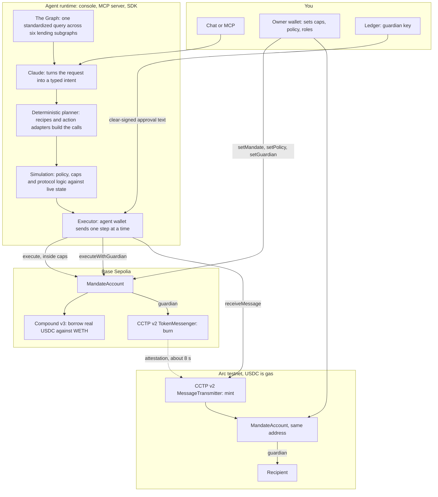

The user delegates *bounded* authority to an AI agent through a smart account they own. The agent plans and executes; the contract enforces; a Ledger co-signs anything irreversible.

## The system

## Components

| Component | Where | Job |
|---|---|---|
| Model | Claude via the Vercel AI SDK or any MCP client | Reads tool results, produces one structured **intent**, explains. Never writes calldata, never holds a key. |
| Planner | `@yashjain99/mandate-sdk` recipes and action adapters | Turns the intent into typed steps with concrete calls, a binding `maxUsdcOut`, and a guardian flag derived from the on-chain policy. |
| Simulation | SDK | Dry-runs the next step against live state; later steps are checked statically and re-simulated right before they run. |
| Executor | SDK, driven by `execute_step` | Asks the chain whether a step already ran, then sends it through the account. Idempotent by construction. |
| MandateAccount | Solidity, Base Sepolia and Arc, same address | Allow-list of target and selector, per-transaction and rolling daily caps on **measured** USDC outflow, guardian verification, replay guard. |
| Guardian | A Ledger, over WebHID in the browser or USB in Node | Clear-signs a nine-line text approval for irreversible steps. |
| Owner | A browser wallet | Sets and revokes the mandate, edits policy, rotates roles, withdraws. |
| Market data | The Graph, Messari standardized lending subgraphs, plus Morpho | Live USDC borrow rates; the venue with an implemented executor is recommended. |
| Store | memory, JSON files, or Upstash Redis | Plans, approvals and the audit trail. |

## Where each guarantee lives

| Guarantee | Enforced by | Not by |
|---|---|---|
| Only allow-listed calls | `MandateAccount.policies` on every call, wildcard `address(0)` per selector, explicit deny beats wildcard | the planner, which merely refuses to build what the policy forbids |
| Spend caps | `_runMeasured`: balance before and after **each** call, decreases summed, checked against `perTxCap` and the 24-hour `dailyCap` | any number the agent declares |
| Human on irreversible steps | `executeWithGuardian`: rebuilds the approval text from typed arguments, recovers the signer, checks deadline, consumes the nonce, enforces `maxUsdcOut` on measured outflow | the UI |
| No double execution | `executed[planId][step]` in the contract; the executor also probes the chain before every send | retries being careful |
| Same account on both chains | `MandateFactory` through the canonical CREATE2 deployer, configured after deployment so the init code is chain-independent | a lookup table |
| The guardian cannot escalate | a signature never lifts the allow-list; only the owner changes policy | trust in the device |

## Data flow for one request

1. **Intent.** "I need 10 USDC on Arc by Friday to pay 0x…. Don't sell my ETH." becomes `{ amountUsdc: 10, recipient, constraints: { doNotSell: ["ETH"] }, repayInDays: 7 }`.
2. **Rates.** One GraphQL document runs against Aave v3 (three networks), Compound v3 (two) and Spark; the on-chain Compound rate on Base Sepolia joins as the executable twin.
3. **Plan.** Five steps: supply and borrow (agent), CCTP burn (guardian), mint on Arc (agent, direct), payment (guardian), schedule repayment (agent).
4. **Simulate.** Step one dynamically, the rest statically; the console shows verified versus deferred.
5. **Execute.** The borrow lands on its own. At the burn, the model pauses; the Ledger shows the text; the contract verifies it. The mint follows the attestation. The payment needs the second tap. The repayment intent is recorded on Arc.
6. **Audit.** Every plan, simulation, approval request, signature and transaction is written to the store with reasoning and explorer links.

## Surfaces

- **Console** (`apps/web`): Next.js chat with `toolApproval`, owner page, activity page, Ledger approval sheet.
- **MCP server** (`@yashjain99/mandate-mcp`): the same tools for Claude Desktop, Cursor or Claude Code, with the guardian pause made explicit.
- **SDK** (`@yashjain99/mandate-sdk`): everything above without a model, for your own agent or script.

Read next: [Bounded delegation](/docs/concepts/bounded-delegation), [Mandates and caps](/docs/concepts/mandates-and-caps), [Guardian approvals](/docs/concepts/guardian-approvals).
