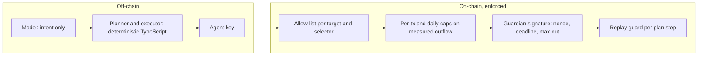

A `MandateAccount` is a user-owned smart account with three roles. The contract, not any off-chain component, decides what each role may do.

## Roles

| Role | Who holds it | May | May not |
|---|---|---|---|
| Owner | The person, with a browser wallet | Set or revoke the mandate, edit the allow-list, rotate agent and guardian, withdraw anything, call `ownerExecute` | |
| Agent | A hot wallet the model drives (local key or Circle developer-controlled wallet) | Call `execute` with allow-listed calls inside the caps; call `executeWithGuardian` with a valid guardian signature; send permissionless transactions from its own wallet (CCTP `receiveMessage`) | Move value beyond the caps; call anything not allow-listed; bridge or pay a third party without the guardian; change any setting |
| Guardian | A Ledger | Approve one specific step: account, chain, plan, step, max USDC out, calls hash, deadline, nonce | Approve a target the owner has not allow-listed; reuse a signature; exceed the approved maximum |
| Model | the LLM driving the agent | Read data, draft an intent, explain, sequence tool calls | Produce calldata, sign, or see a key |

## Trust boundaries



Everything to the left of the chain is convenience; everything on the chain is the guarantee. If the SDK had a bug and sent a call outside the policy, the contract would revert with `CallNotAllowed`. If the model tricked the planner into an oversized payment, `PerTxCapExceeded` or `MaxOutExceeded` would fire.

## What the model actually does

The model receives tool results and produces one structured object, the **intent**:

```ts
{ kind: "liquidity", amountUsdc: 100, destinationChainId: 5042002, recipient: "0x…", constraints: { doNotSell: ["ETH"] }, repayInDays: 7 }
```

The SDK turns the intent into typed steps through a **recipe**, each step through an **action adapter** into concrete calls, and simulates them. The model then calls `execute_step` one step at a time. Its only levers are which tool to call next and how to explain the result.

## Why a smart account and not a session key

Session keys bound a signer, but the rules live in the signer's policy module and usually cannot measure what actually happened. Mandate's caps are computed from the account's own balance before and after each call, so a step that borrows 500 and pays 90 is charged 90, not 0, and an adapter cannot hide a payment behind an inflow. See [Mandates and caps](/docs/concepts/mandates-and-caps).

## Failure modes it is designed for

- **The agent key leaks.** The thief can call `execute` inside the caps against allow-listed protocols only. They cannot pay themselves: payments and bridges need the Ledger. The owner rotates the key with `setAgent`.
- **The model hallucinates.** Calldata is never model-written; the worst case is a plan that fails simulation.
- **The process crashes mid-step.** Every `(planId, step)` executes at most once on-chain, and the executor asks the chain before re-sending. See [Plans and steps](/docs/concepts/plans-and-steps).
- **The guardian is compromised.** A guardian signature cannot lift the allow-list, so funds can only go to owner-approved targets.
