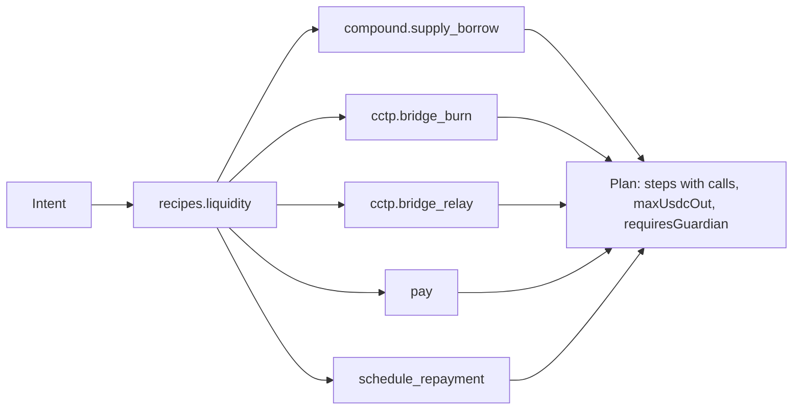

## Intent → recipe → steps

The model produces an **intent**. A **recipe** turns it into an ordered list of **action requests**, and each request's **adapter** builds the concrete calls for one **step**.



Two recipes ship: `recipes.liquidity` (borrow, bridge, pay, schedule) and `recipes.repayment` (bridge back from Arc only for what Base cannot cover, repay, withdraw collateral, mark repaid). Recipes check real balances before drafting: asking to repay more than the account holds across both chains yields a plan for the available amount with an explanation, not a step that reverts. You can also call `client.plan(requests, opts)` with your own list of action requests.

## Step kinds

| Kind | Chain | Reversible | Guardian | What it does |
|---|---|---|---|---|
| `supply_borrow` | Base Sepolia | yes | no | wrap ETH, supply WETH, borrow USDC on Compound v3 |
| `bridge_burn` | source chain | no | **yes** | CCTP v2 `depositForBurn` toward the destination domain |
| `bridge_relay` | destination chain | yes | no | fetch the Iris attestation, call `receiveMessage` from the agent wallet |
| `pay` | Arc (or Base) | no | **yes** | native or ERC-20 USDC transfer to a recipient |
| `schedule_repayment` | Arc | yes | no | record a repayment intent on the account |
| `repay` | Base Sepolia | yes | no | repay Compound, optionally withdraw freed WETH |
| `mark_repaid` | Arc | yes | no | close a repayment intent |

`requiresGuardian` on a step is derived from the on-chain policy at build time (`guardianRule: "policy"`), so the plan card shows exactly what the contract will demand.

## Account calls versus direct calls

Most steps are `calls[]` routed through `MandateAccount.execute` or `executeWithGuardian`. Two are **direct**: the agent wallet sends them itself because they are permissionless and do not touch the account's authority. The CCTP relay is one (`receiveMessage` mints to the account no matter who calls it). Direct steps carry their own idempotency probe, for example CCTP's `usedNonces`.

## Simulation

`client.simulate(plan)` is progressive. The first pending step is simulated dynamically against live chain state: policy, caps, and the protocol's own logic through a batched `ownerExecute` dry run. Later steps depend on earlier ones (you cannot simulate a mint before the burn), so they are checked **statically**, allow-list only, and reported as `deferred`.

```ts
{ results: [{ step: 1, ok: true }, { step: 2, ok: true, deferred: true }, …], verified: 1, deferred: 4, failed: 0 }
```

`deferred` is not counted as verified, the console renders it as a distinct state, and `execute` re-simulates every step against live state immediately before sending it.

## Execution and idempotency

`client.execute(plan, index)` does, in one guarded sequence:

1. Refuse if an earlier step is not done.
2. **Ask the chain first.** For account steps, `executed[planId][step]`; for direct steps, the adapter's `isExecuted`. If the chain says it already ran, recover the transaction hash from `StepExecuted` logs and mark the step done without re-sending.
3. Re-simulate the step.
4. For guardian steps, fetch a stored approval, check its nonce and deadline are still live, or return `{ ok: false, awaitingGuardian: true, approval }`.
5. Send, wait for the receipt, persist `done` with the hash immediately.
6. Run `afterExecute` enrichment (health factor, minted amount from receipt logs) in its own try; failures become notes, never a failed step.

The contract's replay guard is the backstop: `StepAlreadyExecuted` reverts a duplicate even if every off-chain check were bypassed.

## Statuses

`pending → simulated → awaiting_guardian → executing → done | failed`. `skipped` is terminal too. `isDone(step)` is the shared helper.

## Where plans live

Plans, pending and signed approvals, and the audit trail go through the `Store` interface: `memoryStore()` by default, `fileStore(dir)` for a single machine, `redisStore(redis)` for serverless hosts. See [Stores](/docs/reference/sdk/stores). Everything is JSON; bigints are stored as decimal strings and adapters coerce with `BigInt()` when reading params.
