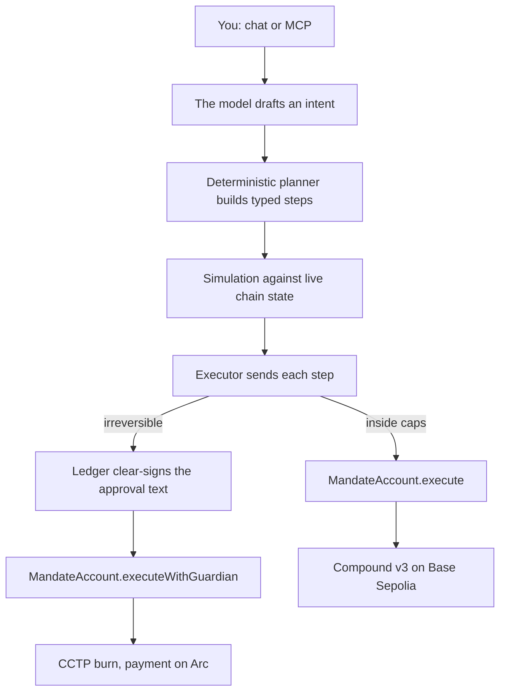

Mandate is bounded delegation for AI agents. You own a smart account. You decide which contract calls the agent may make, how much USDC may leave per transaction and per day, and which actions need a tap on your Ledger. The agent plans and executes inside those limits. The contract enforces them, not the model.

<Cards>
  <Card title="Quickstart" href="/docs/introduction/quickstart" description="Talk to the live agent, or run the MCP server against the public testnet account." />
  <Card title="Bounded delegation" href="/docs/concepts/bounded-delegation" description="Owner, agent, guardian: who can do what, and what the contract refuses." />
  <Card title="SDK reference" href="/docs/reference/sdk/client" description="createMandate, MandateClient, actions, stores and guardians." />
  <Card title="Deploy your account" href="/docs/guides/deploy-account" description="Foundry scripts for Base Sepolia and Arc, same address on both chains." />
</Cards>

## How a request flows

## What ships

| Layer | Package or path | What it does |
|---|---|---|
| Contracts | `contracts/` | `MandateAccount` and `MandateFactory`, Foundry, deployed on Base Sepolia and Arc testnet at the same address |
| SDK | `@yashjain99/mandate-sdk` | Plan, simulate, execute, approvals, stores, guardians, market data |
| AI tools | `@yashjain99/mandate-ai` | Vercel AI SDK tools with a tool-approval policy, MCP registration, system prompt |
| MCP server | `@yashjain99/mandate-mcp` | `npx @yashjain99/mandate-mcp` for Claude Desktop, Cursor or any MCP client |
| Console | `apps/web` | Next.js chat and owner console with Ledger WebHID approvals, live at [mandateagents.vercel.app](https://mandateagents.vercel.app) |
| Skills | `skills/` | `mandate-agent` for operating an account, `mandate-integrate` for adding Mandate to your agent |

Built for ETHOnline 2026 with [Arc and Circle](/docs/sponsors/arc-circle), [The Graph](/docs/sponsors/the-graph) and [Ledger](/docs/sponsors/ledger).
